# os

<font size="2">&emsp;***纸上得来终觉浅，方知此事要躬行***。

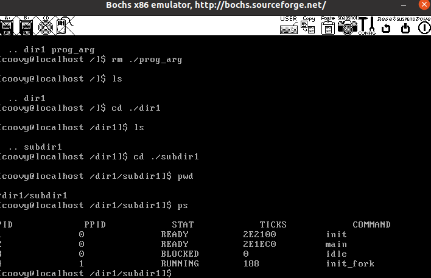
&emsp;计算机的世界，硬件就是树根，操作系统是个偌大的主干，网络是四周的枝干，其他的上层应用，ai之类都是繁茂的枝叶。</font>

<font size="2">&emsp;1978年6月8日intel发布第一款16位处理器: 8086, 有20根地址线, 所以2^20=1MB内存，这个时候下x86架构工作模式是实模式(尽管这是后来才有的命名), 它直接访问物理内存， 没有特权级，段基址随意修改，一次只能运行一个程序，内存只有1MB, 看一下这1MB的内存布局吧(p53):</font>

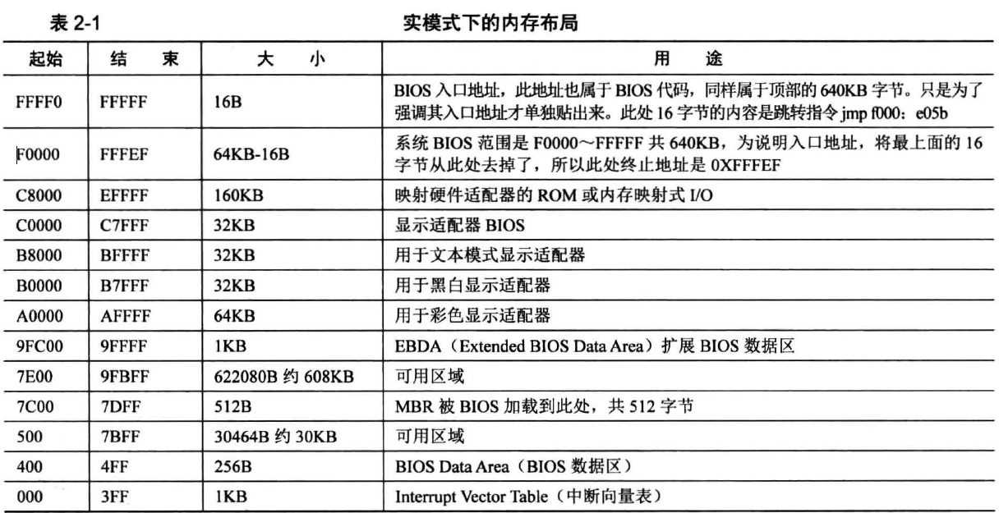

<font size="2">&emsp;这20根地址线，经过分配, 其中0\~0x9FFFF处是640KB的DRAM，就是咱们插上的内存条，0xF0000\~0xFFFFF这64KB是ROM, 里面存的是BIOS代码，中间是显存。中间还夹杂着一些可用区域。其中BIOS的工作是检测，初始化硬件，这是调用硬件本身提供的一些功能调用实现的，此外，它还建立了中断向量表，使得以后可以通过`int 中断号`实现相关硬件调用。</font>

<font size="2">&emsp;BIOS是计算机上运行的第一个软件，由硬件厂商写入顶端0xF0000\~0xFFFFF, 程序执行的入口地址便是0xFFFF0。一个16位的寄存器是访问不了20位的地址空间的,所以这个实模式下采用了**段基址: 段内偏移量**的组合，称为分段模式，将`段基址*16+段内偏移量`当作真正的地址。开机接电一瞬间, cpu的cs: ip寄存器被硬件初始化为`0xF000:0xFFF0`, 那么`0xF000*16+0xFFF0=0xFFFF0`, 这16B太小显然不可能是BIOS完全的代码, 实际上这里是一个跳转指令`jmp far f000:e05b`(书中写完mbr可以看到), 跳转到bios真正执行的地方, 然后检查内存，先科等信息， 再初始化硬件， 建立中断向量表*IVT*。(现在x64已经拥有了更强的启动方式，**UEFI**!!)。</font>

<font size="2">&emsp;BIOS最后的工作是检验启动盘(扇区末尾两字节是0x55和0xaa这两个魔数)0盘0道1扇区的内容(CHS表示硬盘扇区), BIOS最后的指令跳转到0x7c00(实模式内存布局中也可以看到这里是MBR被BIOS从磁盘中加载进来的位置), 至于为什么是0x7c00, 历史传承因素而已，是因为早期DOS1.0最小是32KB内存将MBR放到了最后1KB位置(`0x8000-0x400=0x7c00`), MBR的作用就是加载loader(内核加载器), 其实就是将loader文件从磁盘装进内存, 然后jmp到loader的地址。</font>

<font size="2">&emsp;然后是loader程序, 设定程序内存起始地址是`0x900`, 这是低30KB处的一段可用区域, 选取`0x900并没有特别的意思，仅仅是因为这段内存可用, 尽量从低地址写，留下一点栈空间，而已，这本书的作者喜欢取整，就选取了这个地址，这个loader程序不超过512B, 所以也占用一个扇区，它被MBR从磁盘加载进内存, 然后jmp过去。loader是内核加载程序，是用来加载内核程序的，内核程序有很多东西，有中断，内存管理系统，进程，线程管理，文件系统等等。这中间还有分页的概念，还有实模式很多没解决的问题，需要在loader中解决一些。准备进入32位保护模式。补充一下，硬盘第一个扇区存的的是MBR所以第一个扇区叫做MBR引导扇区，后面这个从第二个扇区开始放了loader叫做操作系统引导块(OS boot record),为什么是块？因为不同文件类型的OBR占用不同大小的空间给OBR。但是这部分现在不用考虑，因为这里还没有文件系统，我们直接是裸盘操作，关于分区文件系统，后面再添加一个硬盘进行书写。</font>

<font size="2">&emsp;保护模式是32位的，用的32位寄存器，前面的mbr在实模式下用的只是这32位寄存器下的低16位。而且只用了部分寄存器，这样模拟的实模式环境。毕竟这本书写的是32位系统。1985年推出32位处理器80386，地址总线和寄存器都是32位，只不过还兼容之前的实模式。汇编中区分代码是在实模式还是保护模式其实就是一个指令: `[bits 32]`就是说下面的指令运行在保护模式，不写默认是`[bits 16]`，这是编译器实现的。但是作为loader怎么进入保护模式(从16位进入32位),其实就是1.打开A20(有根地址线控制着是否可以访问超过20根地址线的空间, 打开了就能访问高于20位地址空间了，不然就是回绕访问),2.加载gdt, cr0的pe位置1(crx是控制寄存器系列，这个位告诉cpu是什么模式) </font>

<font size="2">&emsp;保护模式是分段的，关于分段，一个重要的概念:*GDT(Global Descriptor Table)*全局描述符表, 它的地址被加载进GDTR寄存器:</font>
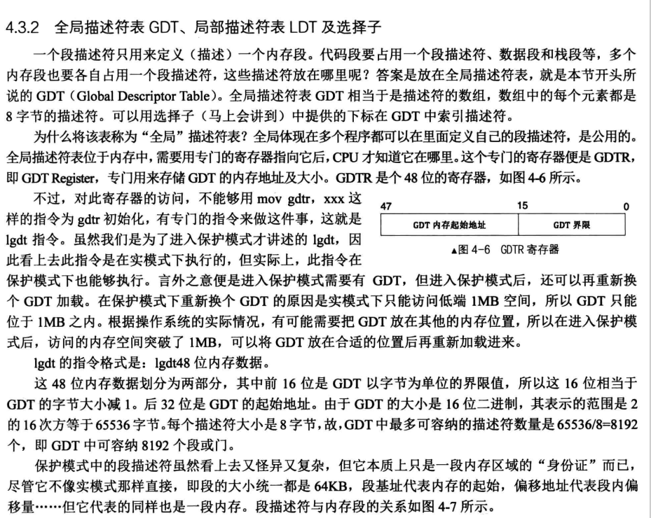

<font size="2">&emsp;全局描述符表中存储着**连续的32位**的段描述符, 它描述着每个段的信息, 看起来很乱？是为了兼容之前的16位cpu产品: 
 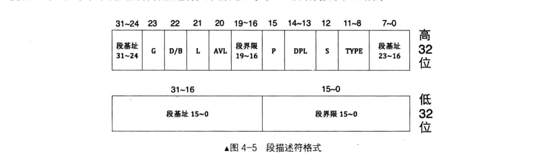
 &emsp;在平坦模式(现在都是)下段基址都是0，G位表示段界限粒度，就是1B还是4KB，G==1表示4KB，此时16位段界限`2^16 * 4KB=4GB`,每个段享受的空间都是4GB(整个内存大小)，由虚拟地址空间区分保护不同的进程，数据。有了GDT，段寄存器里面存的就不是段基址，而是叫做选择子了，用来选择段描述符, 不过第0个段描述符是不可用的，因为未初始化的选择子的值为0，防止未初始化的选择子访问:
 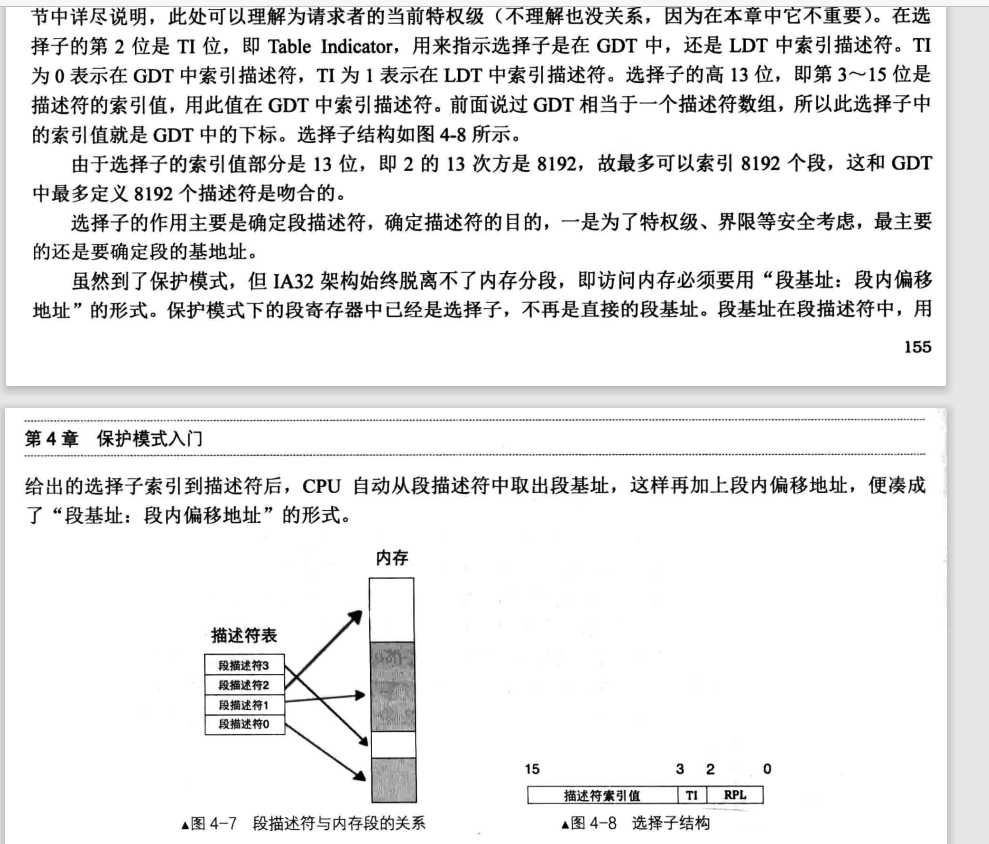
 </font>

<font size="2">&emsp;关于页表的初步创建也在loader里面。记录一下关于分页机制的设计。

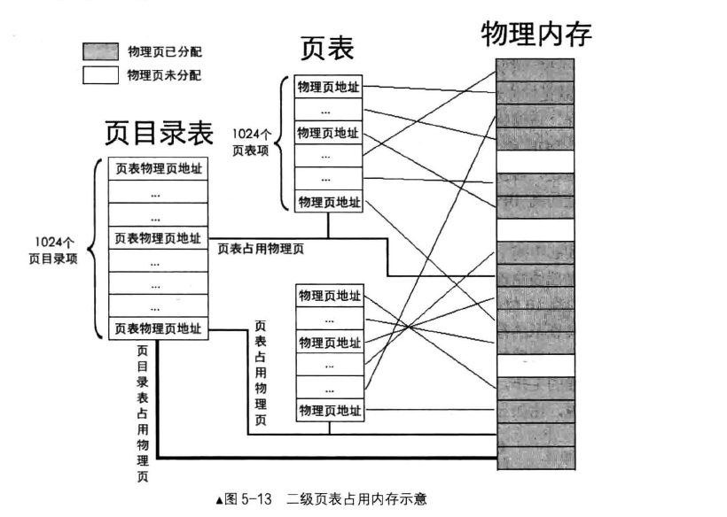

见`src/include/boot.inc`的`PAGE_DIR_TABLE_POS`定义0x100000, 刚好是出低端1MB, 这是设计的页目录项的起始地址，操作系统会将页目录表的基地址加载到特定的控制寄存器中，不用担心寻找的问题。接下来会有很巧妙的设计!

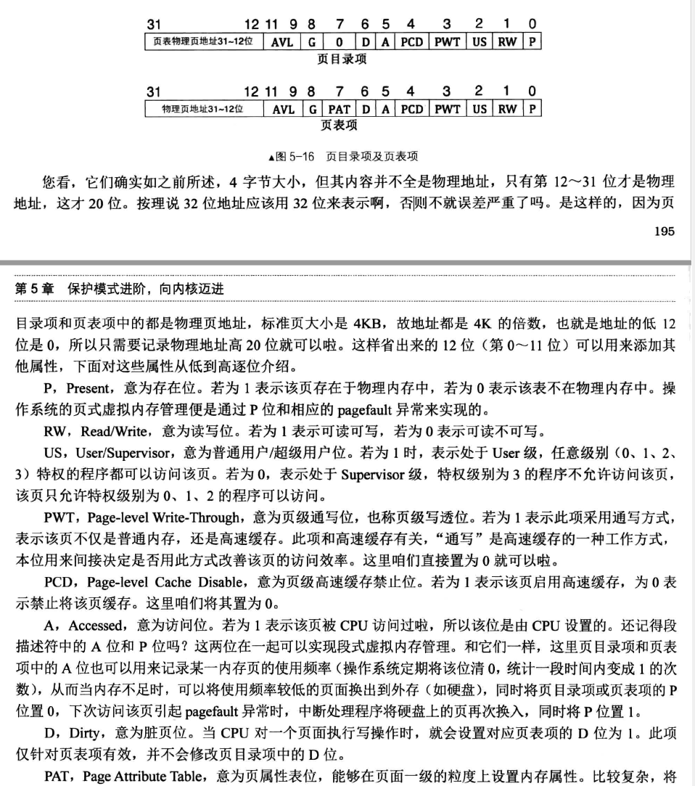

可以看到页目录表和页表都是4B，页目录表一般只有是一页, 毕竟`4KB/4B=1K=1024=2^10`个页表，每个页页表中有2^10个页目录项，一个页目录项代表一页，那么`2^10 * 2^10 * 4KB = 4GB`, 足够了。让页目录表和页表紧凑(非必要),第一个页表地址就是0x10100。将页目录项0和0xc00都存为第一个页表的位置，原因是第一个页表存有2^10 * 4KB = 4MB内存，低端的1MB内存是在第一个页里面。0xc00指向的页是`3GB~4GB`内存，之后打算将这部分作为系统的内存，参考的linux，将这部分用作内核的内存空间，所以将3GB以上的这一页也映射为低端4MB内存.并且页目录项的最后一个目录项的地址是谁呢？是这个页目录项本身的物理地址。这个是为了之后用虚拟地址时能用到(通过虚拟地址找页目录表，直接高10位全1然后-4不就是最后一个页目录项地址即页目录的地址)。
</font>

 <font size="2">&emsp;所以总结一下loader干了什么：构建GDT和里面的描述符, 三步骤开启保护模式，创建页目录项PDE和页表PTE, 在保护模式里(就是[bits 32] 然后下面的代码...)把内核代码从磁盘加载到内存, 然后jmp到内核入口地址。</font>

 <font size="2">&emsp;然后就是咱们的内核部分，要实现很多部分，首先是如何打印一个字符串？我记得刷过一个哈工大老师讲连接器和加载器时，问过一个问题，如何写一个最小的打印`hello world`的程序？其实很简单，调用库函数肯定不行，因为那样会增加很多前后处理的过程指令。所以最简单的就是汇编一个指令将字符写到显存部分即可，看实模式内存布局应该也能明白。不过显卡还提供了一些端口(就是外设提供的寄存器用于数据传输，操作某个设备)进行操作外设，我们可以操作这些端口打印字符，封住这样的打印字符函数，然后进而封装打印字符串和打印整数，这是这几个函数实现的原理。</font>

 <font size="2">&emsp;记录一下中断。先记录一下感觉没必要记录几个概念，外部中断是指来自cpu外部的中断，外部中断源必须是某个硬件，所以又称为硬件中断，比如网卡收到数据后发起的中断, cpu提供两根信号线区分外部中断的类型: INTR和NMI。 由于INTR的中断不影响系统运行，所以叫可屏蔽中断。NMI线过来的那些中断是灾难性的，无法屏蔽，所以其实即使eflags的IF设置关中断也不能阻挡。

 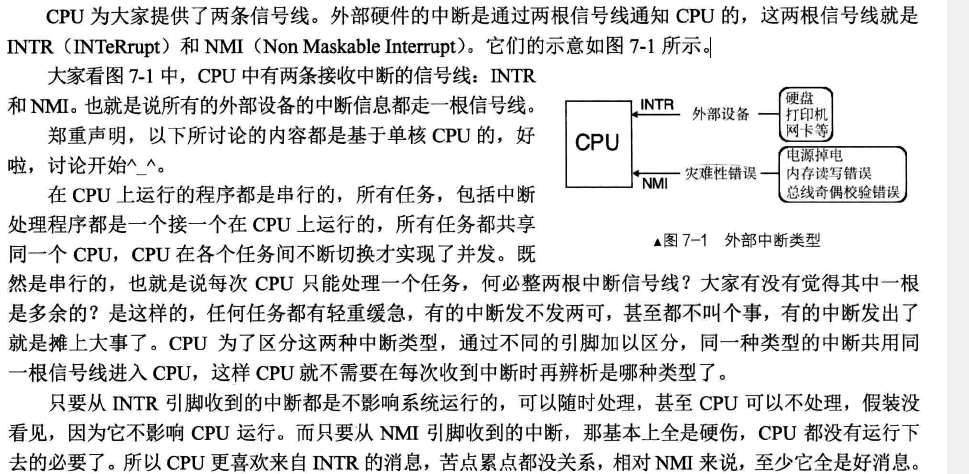

&emsp;内部中断分为软中断和异常，软中断是指软件主动发起的中断， 比如`int 8位立即数`
常用的系统调用, 异常指cpu运行时错误，兜不住了，比如除以0， 所以像NMI一样，无法被屏蔽。

&emsp;中断向量就是一个中断的编号，可以看`records/异常与中断.png`这个表, 其中`0~31`系统保留，用于处理自己内部的中断，异常什么的。32以上可以自己分配处理外部设备的中断。类比GDT, 这里也有个中断描述符表的概念，里面存放着任务门描述符，中断，门描述符，陷阱门描述符，调用门描述符。详细还要看`p305`, 但是总之就是用8B指向一段处理程序的地址,中断描述符表的地址存放在IDTR(Interrupt Descriptor Table Register)。所以中断过程: 外部设备发出中断，由中断控制器(书中用的是Intel 8259A)接收中断，中断控制器经过根据优先级裁决出执行哪个中断，把中断向量号发给cpu，cpu根据中断向量号(中断描述符的索引)找到对应的门描述符，进而找到对应的处理程序, 这一段是CPU内部的中断处理机制自动完成，我们做的是维护了一个中断门描述符数组和里面自己写的中断处理函数，将这个数组地址写入了idtr，cpu根据中断向量号找到对应的中断门描述符，然后找到并对应的中断函数。所以初始化中断描述符表->异常名初始化并注册通常的中断处理函数->初始化8259A->idt表地址写入idtr。关于中断时，栈中数据的变化看p309。lidt将中断描述符表含有idt地址的信息加载进寄存器，所以根据中断向量号->idt[索引]得到含有中断处理程序地址信息的中断门描述符->调用对应中断例程(其实是个入口)->调用中断处理程序数组idt_table[IDT_DESC_CNT]里面嵌套的咱们自己写的处理程序。

**&emsp;但是这里是不是应该有个特权级的概念，其实在GDT的DPL字段就开始有特权级概念了，比较复杂, 我看得也很迷糊，不过总之需要了解DPL, RPL, CPL的关系，切换段的时候要判断特权级。另外切换处理程序是需要保存上下文环境的，就是将相关寄存器内容备份到栈中(可以看一下汇编指令`pushad`)**, 还是试着概述一下吧，以后再修正，段描述符中有两位DPL(Descriptor Privilege Level), 段选择子中的叫RPL(Request Privilege Level), 均占两位, 表示级别由高到低`0~4`, CPL叫Current Privilege Level存在于cs中, 代表着当前执行的段的特权级, 所以说DPL就是未来的CPL, 访问某个段的时候，os会构建选择子去访问，然后判断特权级关系。DPL中还有一位S标记段是否是系统段, 系统段(硬件所需的结构，各种门结构，调用门，任务门等), 软件所需的都是非系统段。下面讨论非系统段
，区分代码段和数据段，段有两个概念:1.一致性代码: 操作系统拿出来被共享的代码段,可以被低特权级的用户**直接调用**访问的代码。通常这些共享代码，是不访问受保护的资源和某些类型异常处理。比如一些数学计算函数库,为纯粹的数学运算计算。2.非一致性代码:为了避免低特权级的访问而被操作系统保护起来的系统代码。是由段描述符中4位type中的一位标记是否是一致性代码。然后再一个概念: 是否通过调用门的跳转？像我们平时jmp或者call直接跳转到另一个label, 然后就到目标代码的地址执行代码了。通过门跳转就是通过那些中断门描述符，任务门描述符，调用门描述符之类的结构(存储着段选择子和段偏移), 再找到目标代码段，中间是通过这个门数据结构找到的目标代码段。然后不经过门结构的普通跳转是不会引起CPL的变化的。
一致性代码限制了仅仅允许低特权级访问高特权级代码，但是CPL不变，非一致性代码仅仅允许同级访问。
&emsp;即对于非一致性代码段，要求:数值上CPL=RPL=目标代码段DPL; 对于一致性代码段: 数值上CPL>=目标代码段DPL && RPL>=目标代码段DPL。对于受访者为数据段时:数值上CPL<=目标数据段DPL && RPL<= 目标数据段DPL
</font>然后就是线程的调度，关于内核级线程和用户级线程还是有必要说明的。内核级线程就是在内核中实现线程，然后程序员就能调用创建内核线程，时间片轮转的话，对于每个线程都是平等的，公平竞争cpu时间，所以线程多了，拿到的cpu时间也多，所以更快。但是关于用户级线程，在用户级实现线程的调度，使用回调函数实现这一过程，内核是感知不到的，对于内核就是一个线程在运行，所以它和内核级多个线程去多多争取cpu时间是不一样的，所以用户级线程是比不上内核级线程的。想起python，咱们大多都是用的cpython这个解释器，它有个全局锁，它的执行其实就是单线程的，尽管可以在python中创建多线程，但是对于内核就是单线程，这应该就是python效率低的一个重要原因吧。
</font>

<font size="2">&emsp;关于内存管理，这是个很精妙的东西，以往在书上基本都只是知道由虚拟地址到物理地址转换那一套东西。在内核中，我们维护着一个内存池的结构体(主要包含内存大小，起始地址，位图，一个锁),由这个结构体实例化出**全局的内核物理内存池和用户物理内存池**。内核有自己的页表结构，这是以前书上的一套。然后每个进程都有自己的页表结构，存储虚拟地址到物理地址的映射。这样实现虚拟地址的连续和物理地址的不连续。然后就是经常看到的一般4KB为一个页框，操作系统分配内存以一页为单位。不过还有一个arena的东西实现了更精细的内存分配(**可以看一下linux的buddy**), arena就是
```
struct arena{
   struct mem_block_desc* desc;     // 此arena关联的mem_block_desc
   /* large为true时, cnt表示页框数, 否则cnt表示空闲mem_block数量 */
   uint32_t cnt;
   bool large;
};
``` 
mem_block_desc是内存块描述符,
```
/* 内存块描述符 */
struct mem_block_desc{
   uint32_t block_size; // 内存块大小
   uint32_t blocks_per_arena; // 这个arena里可容纳的mem_block数量
   struct list free_list;     // 目前可用的mem_block链表
};
```
&emsp;它俩实现了更小粒度在堆上的内存分配，而内存回收则是将内存块放到free_list，如果arena->cnt == blocks_per_arena将页表p位清零。</font>

<font size="2">&emsp;关于线程的实现是由时钟中断来进行调度的，这块挺复杂的，分为两部分，一部分是中断时的保护，另一部分是调度时的保护。中断时的保护就是所有寄存器，调度时根据ABI的规定，只需要保护esi, edi, ebx, ebp, 和esp(abi规定这四个寄存器+esp归主调函数所有，其余归被调函数)。实现这个功能其实也不难，就是定义PCB记录一个线程的相关信息(栈顶，虚拟地址，优先级，运行时间，状态和存于某个队列的标志之类), 然后维护相关队列，切换进程时间保护和恢复上下文环境即可。</font>

<font size="2">&emsp;关于输入输出系统，有3部分，锁，键盘驱动，缓冲区.锁就比较简单了, 两个结构体，一个信号量(等待队列和资源数),一个锁结构(持有者，信号量，持有次数),关于持有次数是为了应对自己多次调用，多次释放的问题，然后再加上中断开关的函数，封装成锁的获取与释放，一下子就出来了。关于键盘的处理，首先键盘输入的过程是键盘按下一个键，然后由键盘内部的编码器(书上举例的8048)，向主板的键盘控制器(书上举例的8042)发送一个扫描码(这个也分为按下的通码makecode和松起的断码breadcode), 然后交给相应的中断程序去处理，现在一般用的键盘扫描码是scan code set 2, 不过这个无所谓，因为有8042这个中间件, 它会将收到的扫描码转换为第一套编码(p458表10-1), 然后键盘中断处理程序读取键盘控制器8042的输出缓冲区进行处理，然后这部分和外部硬件打交道的事情一般就交给驱动去做，所以上面描述这套转换操作经过封装形成键盘驱动，又由于比如shell不是一个一个字符处理的，是有命令的这些多字符组成得到特殊序列，所以键盘驱动中增加了个环形缓冲区记录输入的字符。</font>

<font size="2">&emsp;关于进程调度。在32位系统中，主要依靠由硬件支持的TSS任务段，它由于TSS描述符来描述，描述符存储于GDT中。有个TR寄存器专门指向当前运行的任务。TSS中TYPE字段有一位B(busy)，作用有：表示自己在运行，另一方面表示自己嵌套了其他任务，还防止自己调用自己，被call指令嵌套调用时，老任务的B位也会保持1。有了TSS 后，任务在被换下CPU时，由CPU自动地把当前任务的资源状态(所有寄存器、必要的内存结构，如栈等)保存到该任务对应的TSS(由寄存器TR指定)。CPU通过新任务的TSS选择子加载新任务时，会把该TSS中的数据载入到CPU的寄存器中，同时用此TSS描述符更新寄存器TR，这个过程由硬件自动完成。TSS由用户提供，由CPU自动维护。

&emsp;插播一段CPU原生支持的任务切换方式(效率低未使用): ldt是局部描述表和gdt对应，ldt也是一段内存区域，存储着任务实体资源，就是指令和数据，属于每个任务私有。ldt由存在于gdt的ldt描述符指向。TSS则存储着任务运行的最新状态。所以任务切换就是切换这两个结构，LDT->LDTR,TSS->TR。任务切换三种方式:"中断＋任务门", "call或jmp＋任务门"和iretd，关于第一种，任务门描述符是可以存于中断描述符表的(也可以GDT,LDT)，iret可以从中断返回中断前代码，也可以调用TSS中上一个TSS任务指针,这点是eflags中NT嵌套位区分的，所以过程是idt中找到任务门描述符->TSS选择子在GDT中索引TSS描述符->查看p位存在->保存旧任务，加载新任务环境(TR, B位，eflags的额NT位，旧任务TSS选择子写入新TSS)->开始运行。关于call和jmp，实际上是任务以TSS为代表，只有包括TSS选择子的对象都可以作为任务切换的操作数，所以可以是call和jmp+TSS选择子或者任务门选择子， 不过jmp是有去无回。iret切换回旧任务的话eflags的NT位必须为1,所以是和call对应, 举例知道任务门在GDT第二个描述符位置，`call 0x0010:0x1234`忽略偏移->找到段描述符检查p位存在->检查特权级`CPL < DPL && RPL < DPL `,RPL是TSS选择子的RPL->满足可以运行就保存旧任务信息开始新任务。这个由于切换繁琐(TSS选择子加载保存设置B位, eflags的NT位，特权级检查等等)几乎都不用。

&emsp;关于实际的进程调度。学linux仅仅使用为0级特权级的任务提供栈。linux的方案是为每个cpu创建一个TSS，一个cpu上的任务共享这个TSS，所以cpu只需要一次性加载TSS,j进程切换只需修改TSS中的SS0和esp0更新为新任务的内核栈的段地址及栈指针。关于任务状态则是压入栈中。用户进程是特权级3，从内核0到用户3的方法是假装中断iretd实现的，具体的就是将进程上下文压栈，让iretd返回。

&emsp;关于用户进程实现。每个进程都有独立的地址空间，实际上是指每个进程有自己独立的页表结构。用户进程的页表不能让用户直接访问到,所以在内核空间来申请一页作为页目录表，虚拟地址存于pcb中，然后把内核页目录表中的内核空间的页目录项复制过去(内核的代码和数据在所有进程之间是共享的),同样的，页目录表最后一项存储着页目录表本身的物理地址。用户程序的装载本质上就是将用户程序中类型为LOAD的段拷贝到指定的内存地址,而这些段的结构可以看elf文件的结构体。创建用户进程的过程就是`process_execute(void* filename, char* name)`, 从内核获取一个物理页作为pcb,然后初始化这个pcb的信息,包括栈，页表之类的，然后放入到某个调度队列中等待调度就好了。

&emsp;插播一下基本的关于程序的内存布局,.text：通常包含程序的执行代码,只读;.rodata (Read-Only Data)：包含程序中使用的常量数据，例如字符串和常量数组。.data：包含已初始化的全局变量和静态变量。.bss (Block Started by Symbol)：包含未初始化的全局变量和静态变量，加载时由加载器清0。关于bss的话，它起始并不占用文件空间，只占用内存空间，所以通常归于数据段，所以bss的作用便成了为程序运行过程中使用的未初始化数据变量预留空间。不过这个不占文件的空间是指elf不用分配数据部分空间去存储，但是elf元数据部分还是会存储相关信息的。
</font>

<font size="2">&emsp;到了进一步完善内核的时候了。关于系统调用, 是用int 0x80软中断触发的，0x80就是软中断的中断向量号。在linux中，c运行库glibc提供系统调用方式是`long syscall(number,...)`, number就是子功能号，会存在eax中, 实际上linux实现系统调用时, 参数按照从左到右, eax保存子功能号，然后ebx, ecx, edx, esi,edi依次保存第1\~5个参数。之所以不用栈是太慢了，从用户3->0还要去3特权级栈中拿数据，涉及内存访问次数太多了。然后具体实现就是维护了一个以子功能号为索引的系统调用数组，在处理0x80中断时取调用对应的内核函数。然后实现了之前内存管理说的arena的更精细化的内存管理。</font>
  
<font size="2">&emsp;这部分是硬盘驱动。工作主要是两个，一个是封装操作硬盘的函数，还有个是将硬盘中的硬盘基本信息读取出来初始化软件的硬盘结构体。关于硬盘，主要参数是柱面数，磁头数，每磁道扇区数。MBR引导扇区前446字节是硬盘参数和引导程序，然后是64B硬盘分区(每16B记录一个分区信息)，最后两字节魔数。关于分区，最开始仅支持4个主分区，后来为了更多分区使得可以把最后一个分区创建为扩展分区，在扩展分区的空间里创建多个子扩展分区，子扩展分区可以划分为多个逻辑分区，每个子扩展分区里的结构和MBR引导扇区相同，子扩展分区中最开始512B是EBR引导扇区，然后64B分区表，后2B是魔数0x55和0xAA。所以每个子扩展分区有1个独立的分区表，每个子扩展分区相当于逻辑上独立的硬盘。EBR\==Expand Boot Record, OBR\==OS Boot Record。BIOS转到MBR之后，MBR找到操作系统引导扇区OBR执行内核加载器。MBR和EBR是有分区表的，是分区工具创建的，它俩所在扇区不属于分区范围，不归操作系统管，但是OBR归操作系统管理，可以往里写数据。**总扩展分区被直接拆分成多个子扩展分区，子扩展分区又被拆分成EBR引导扇区、空闲扇区和逻辑分区三部分**，分区以柱面为单位。
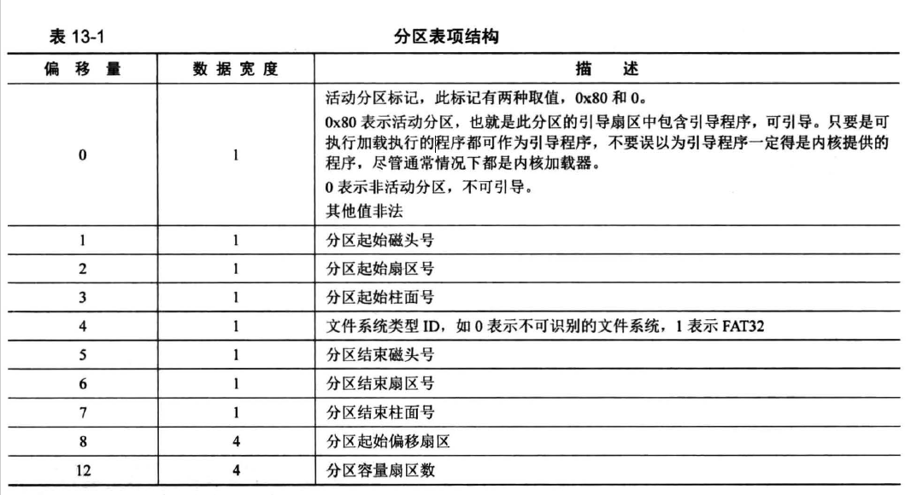

&emsp;**这里的“分区起始偏移扇区”是个相对量**, `各分区的绝对扇区LBA地址＝“基准”的绝对扇区起始LBA地址＋各分区的起始偏移扇区`，这个“基准”是指分区所依赖的上层对象，或者说是创建该分区的父对象。比如
逻辑分区的基准是子扩展分区的起始扇区LBA地址。子扩展分区具体地址基准是总扩展分区的起始扇区LBA地址。主分区或总扩展分区而言，这两类分区本身是独立、无依赖的分区，因此基准为0。书上是这么说的，但是这样算起来，好像和直观感受数扇区一样。看这张图也能明白，偏移0x3f是各分区不能共享一个柱面，而0块被占MBR占用，故偏移一个磁道。
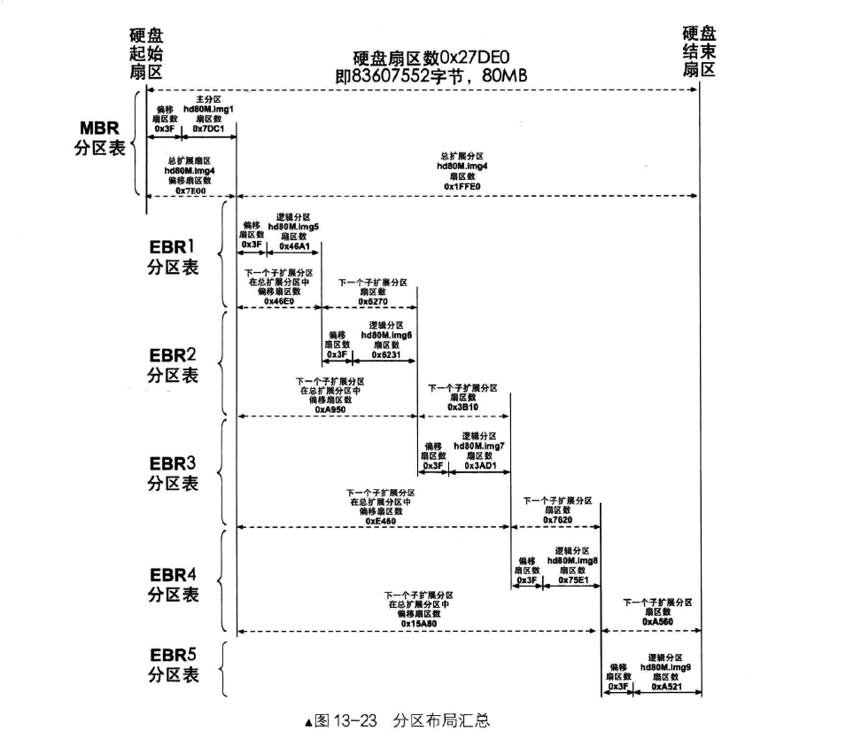
&emsp;介绍一下硬盘。本项目中用的是ide(ata)接口的硬盘。
首先就是一个将硬件映射到软件的硬盘结构体:
```
struct disk {
   char name[8];   // 本硬盘的名称，如sda, sdb等
   struct ide_channel* my_channel;   // 此块硬盘归属于哪个ide通道,一个通道两个硬盘
   uint8_t dev_no;   // 本硬盘是主0还是从1
   struct partition prim_parts[4];   // 主分区顶多是4个
   struct partition logic_parts[8];   // 逻辑分区数量无限,但应有支持上限,这里支持8个
};
```
然后是描述硬盘通道的结构体:
```
struct ide_channel {
   char name[8];      // ata通道名称, 如ata0,也被叫做ide0. 可以参考bochs配置文件中关于硬盘的配置
   uint16_t port_base;   // 本通道的起始端口号
   uint8_t irq_no;       // 本通道所用的中断号
   struct lock lock;       // 每次读写硬盘时会申请锁,保证同步一致性

   /* 表示等待硬盘的中断 */
   bool expecting_intr;

   struct semaphore disk_done;   // 硬盘处理完成。线程用这个信号量来阻塞自己，由硬盘完成后产生的中断将线程唤醒
   struct disk devices[2];   // 一个通道上连接主从两个硬盘
};
```
&emsp;那么这部分是硬盘驱动。工作主要是两个，一个是封装操作硬盘的函数，还有个是将硬盘中的硬盘基本信息读取出来初始化软件的硬盘结构体。
</font>
<font size="2">&emsp;然后就是我之前非常非常想好好了解一下的文件系统了。硬盘是低速设备，操作系统往往会将数据积攒到一定程度然后一次性访问硬盘，这个就是块，windows叫簇。如果选择FAT32文件系统，可以选择不同大小的块，4KB,32KB等。扇区是硬盘读写单位，块是文件系统读写单位。
FAT文件系统是用链式结构组织文件块:
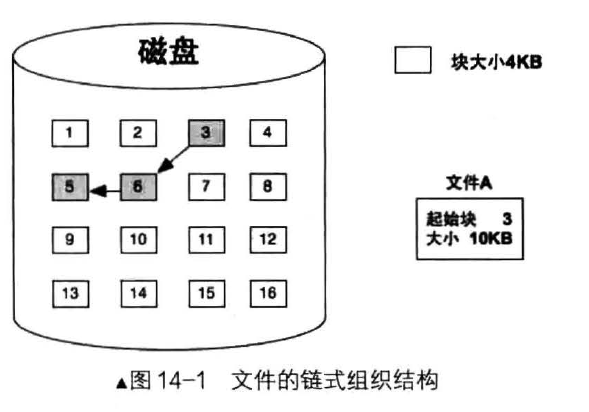
&emsp;UINX操作系统的索引结构--inode,用索引结构组织文件。所以为每个文件建立这样一个index node,包含文件所有块的索引，元信息等。
文件索引结构:
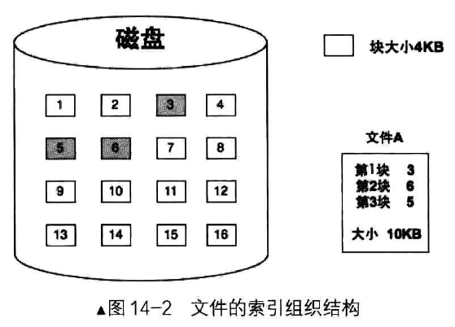
inode结点结构；
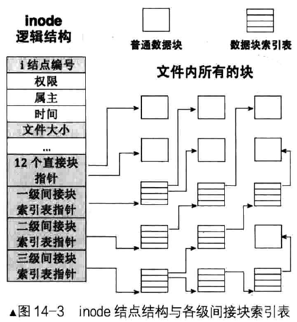

inode与目录项的关系:
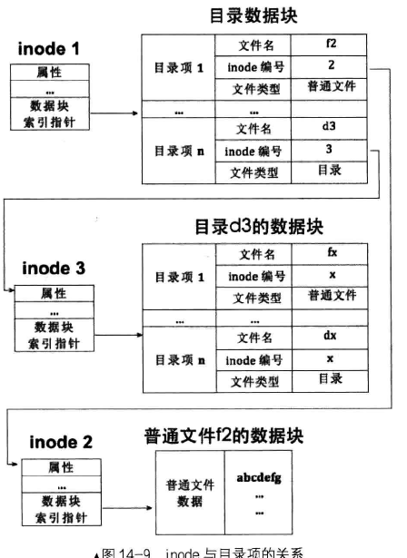

&emsp;但是管理文件系统，我们需要inode数据结构，需要块位图等这些信息，放在哪个位置呢。这个就是超级块的意义，超级块一般放在第二个扇区，在mbr或者ebr之后。
)

&emsp;所以是一个分区一个超级块，每个文件各自对应一个inode。。

&emsp;关于文件描述符，下面是最基本的信息:
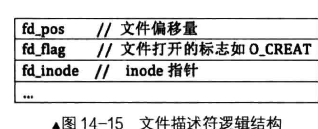

&emsp;在pcb中建一个文件描述符数组，文件描述符数组的索引这个整数就是文件描述符。如何根据这个整数找到对应的文件的呢? 给一个文件描述符，从pcb中根据这个索引(文件描述符)拿到到对应的全局文件表中的索引->inode编号。
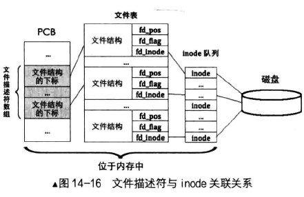

&emsp;然后整个文件系统创建后，封装各种函数(文件和目录的各种操作)时，都围绕着上面"inode与目录项的关系"这张图展开，修改相关结构体。一般原型放在file.h, fs.c中再简易封装一层。体力活和细心活。。。还是挺复杂的。
</font>

<font size="2">&emsp;关于系统交互部分的内容，首先是fork,其作用是进程复制，这点算是基础大家都知道的东西。关于实现复制了那些东西？1.pcb, 2. 程序体,即代码段数据段等，这个是进程实体。3.用户栈，这个是局部变量的保存的地方，函数调用也离不开。4.内核栈，拥有着上下文环境。5.为子进程创建页表。6.复制虚拟地址池位图->重新申请页框，复制数据。然后简单地封装read，put_char, cls系统调用。
&emsp;关于shell的实现。分成两部分吧。首先当最开始就通过操作显存部分显示了一个80*25个界面。然后并且我们也有了获取键盘输入的功能。shell就是一个对输入字符串进行解析，然后根据输入执行相应操作的一个工具。这样理解的话它的实现也比较清晰了，对输入进行处理，非特殊字符就直接显示到界面，如果输入的是某些命令，就进行字符串解析，进行相应功能调用。具体来说，实现了路径的清洗，还创建了部分内建命令(ls, clear, mkdir, rm等)。

&emsp;exec的原理是直接将当前进程体(代码段、数据段、堆、栈)用某个可执行文件体进行替换，达到执行新的文件的目的。如果要执行外部命令的话，那么原理就是bash先fork出子进程，然后exec加载外部磁盘对应的程序。

&emsp; 关于wait和exit。先是几个基础概念。为了提高C语言的开发效率，C标准定义了一系列常用的函数，称为C库函数。C标准仅仅定义了函数原型，并没有提供实现。因此这个任务留给了各个支持C语言标准的编译器。每个编译器通常实现了标准C的超集，称为C运行时库（C Run Time Library），简称CRT。c标准库就是为了避免各个项目，各个单位，各个企业之间重复造轮子不通用，混乱而规定的一个标准接口。所以CRT本质上也是c标准库实现的，是c标准库的扩展，与操作系统息息相关，为了适配本操作系统环境而定制开发的，因此CRT并不通用。CRT做了什么？最主要的是初始化运行环境，进入用户进程的main函数之前和之后的工作。所以CRT才是程序的第一部分，然后调用main, 执行结束再执行系统调用exit或者_exit, 使控制权回到操作系统

&emsp; 关于wait, 一个进程调用wait时就会阻塞自己，然后寻找子进程的返回值(写在pcb中)，没有子进程wait就返回-1, 父进程在wait收到子进程的返回值之后，就会回收子进程的pcb。子进程的返回值就是子进程的主函数的return的值，如果提前exit退出，exit会指定返回值。所以如果父进程没有调用wait, 父进程先执行完毕，子进程后面结束，那么子进程就是孤儿进程，会挂给init进程收尸。但是如果父进程没有调用wait, 子进程先exit退出，这时又不能挂在init进程，就会变成僵尸进程(zombie),ps查看状态是Z，但是其他资源，内存页表之类会被内核收掉，只有pcb。总结：exit是由子进程调用的，表面上功能是使子进程结束运行并传递返回值给内核，本质上是内核在幕后会将进程除pcb 以外的所有资源都回收。wait是父进程调用的，表面上功能是使父进程阻塞自己，直到子进程调用exit 结束运行，然后获得子进程的返回值，本质上是内核在幕后将子进程的返回值传递给父进程并会唤醒父进程，然后将子进程的pcb回收。
附带注释一下，释放用户进程资源: 1.页表中对应的物理页; 2.虚拟内存池本身占物理页框; 3.关闭打开的文件
</font>
